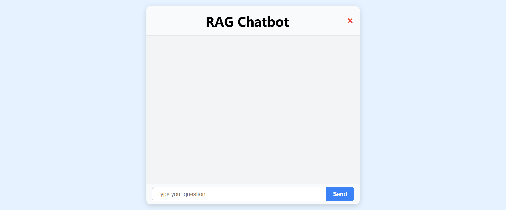
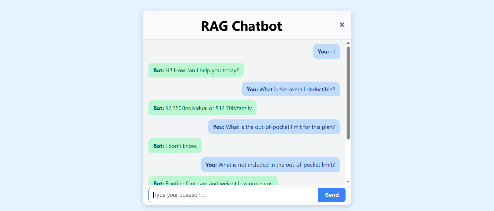
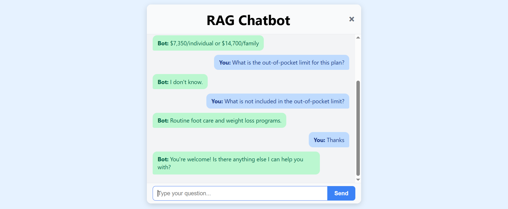

# RAG ChatBot

Welcome to **RAG ChatBot** — a Retrieval-Augmented Generation chatbot built with FastAPI backend and React frontend.

---

## Preview

### Chat Interface


### Bot Response


### Reset Button Feature



## Setup Instructions

### Backend
```bash
cd backend
python -m venv venv
source venv/bin/activate
pip install -r requirements.txt
python app/embed.py
uvicorn app.main:app --reload # Start the backend server
```

### Frontend
```bash
cd frontend
npm install
npm run dev  # Runs on http://localhost:5173
```